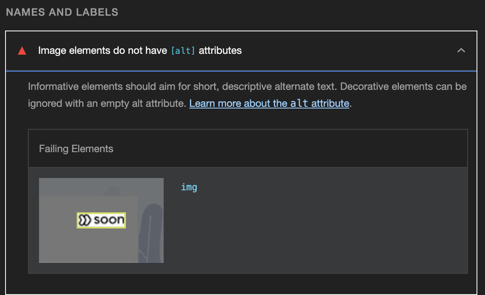

# Lighthouse Fix Note

### Image elements do not have [alt] attributes(이미지에 alt 설정하지 않아 생긴 이슈)


- 문제 코드
  - img 태그에 alt 속성이 없어 생기는 문제
```js
<div style={{ display: 'flex', flexDirection: 'row', justifyContent: 'space-between', alignItems: 'center' }}>
    <div style={{ color: 'black', fontWeight: 'bold' }}>로그인</div>
    {isDevEnv && <div style={{ color: 'red', fontWeight: 'bold' }}>(개발환경)</div>}
    
</div>
```

- 해결 코드
  - img 태그에 alt 속성 추가
```js
<div style={{ display: 'flex', flexDirection: 'row', justifyContent: 'space-between', alignItems: 'center' }}>
    <div style={{ color: 'black', fontWeight: 'bold' }}>로그인</div>
    {isDevEnv && <div style={{ color: 'red', fontWeight: 'bold' }}>(개발환경)</div>}
-----------------------------------
(-)  
-----------------------------------
    
</div>
```

### Background and foreground colors do not have a sufficient contrast ratio.