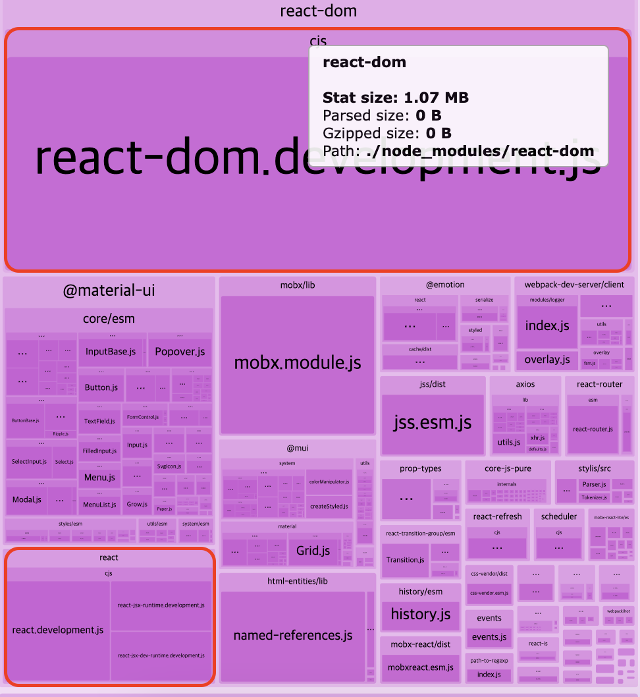

# Lighthouse Performance & Tree Fix Note

## 성능 최적화

### React와 React DOM 트리셰이킹 & CDN으로 변경
- react와 react-dom 패키지의 용량만 1.25MB이기 때문에 이를 번들에서 제외시키면 번들 용량이 엄청 많이 줄게됨

- 해결 코드 `config-overrides.js` : 현재 패키지에서는 js지만 보통은 webpack.config.js에서 external에 설정해주면됨
- `config-overrides.js`
```js
const {
    addDecoratorsLegacy,
    override,
    addWebpackPlugin,
    addBabelPlugin,
    addWebpackExternals,
  } = require('customize-cra');
  const { BundleAnalyzerPlugin } = require('webpack-bundle-analyzer');
  
  module.exports = override(
    ...
    // Webpack 외부 모듈 설정 (CDN 사용)
    addWebpackExternals({
      react: "React", // React를 외부에서 로드
      "react-dom": "ReactDOM",
    })
  );
  
```
- `webpack.config.js`
```js
const path = require("path");

module.exports = {
  mode: "production", // 또는 "development"
  entry: "./src/index.js", // 애플리케이션의 진입 파일
  output: {
    path: path.resolve(__dirname, "dist"),
    filename: "bundle.js", // 생성된 번들 파일 이름
  },
  externals: {
    react: "React", // React를 외부에서 로드
    "react-dom": "ReactDOM", // ReactDOM을 외부에서 로드
  },
  module: {
    rules: [
      {
        test: /\.js$/,
        exclude: /node_modules/,
        use: {
          loader: "babel-loader",
        },
      },
    ],
  },
};
```

### 

## 접근성 수정

### Image elements do not have [alt] attributes(이미지에 alt 설정하지 않아 생긴 이슈)


- 문제 코드
  - img 태그에 alt 속성이 없어 생기는 문제
```js
<div style={{ display: 'flex', flexDirection: 'row', justifyContent: 'space-between', alignItems: 'center' }}>
    <div style={{ color: 'black', fontWeight: 'bold' }}>로그인</div>
    {isDevEnv && <div style={{ color: 'red', fontWeight: 'bold' }}>(개발환경)</div>}
    
</div>
```

- 해결 코드
  - img 태그에 alt 속성 추가
```js
<div style={{ display: 'flex', flexDirection: 'row', justifyContent: 'space-between', alignItems: 'center' }}>
    <div style={{ color: 'black', fontWeight: 'bold' }}>로그인</div>
    {isDevEnv && <div style={{ color: 'red', fontWeight: 'bold' }}>(개발환경)</div>}
-----------------------------------
(-)  
-----------------------------------
    
</div>
```

### Background and foreground colors do not have a sufficient contrast ratio.