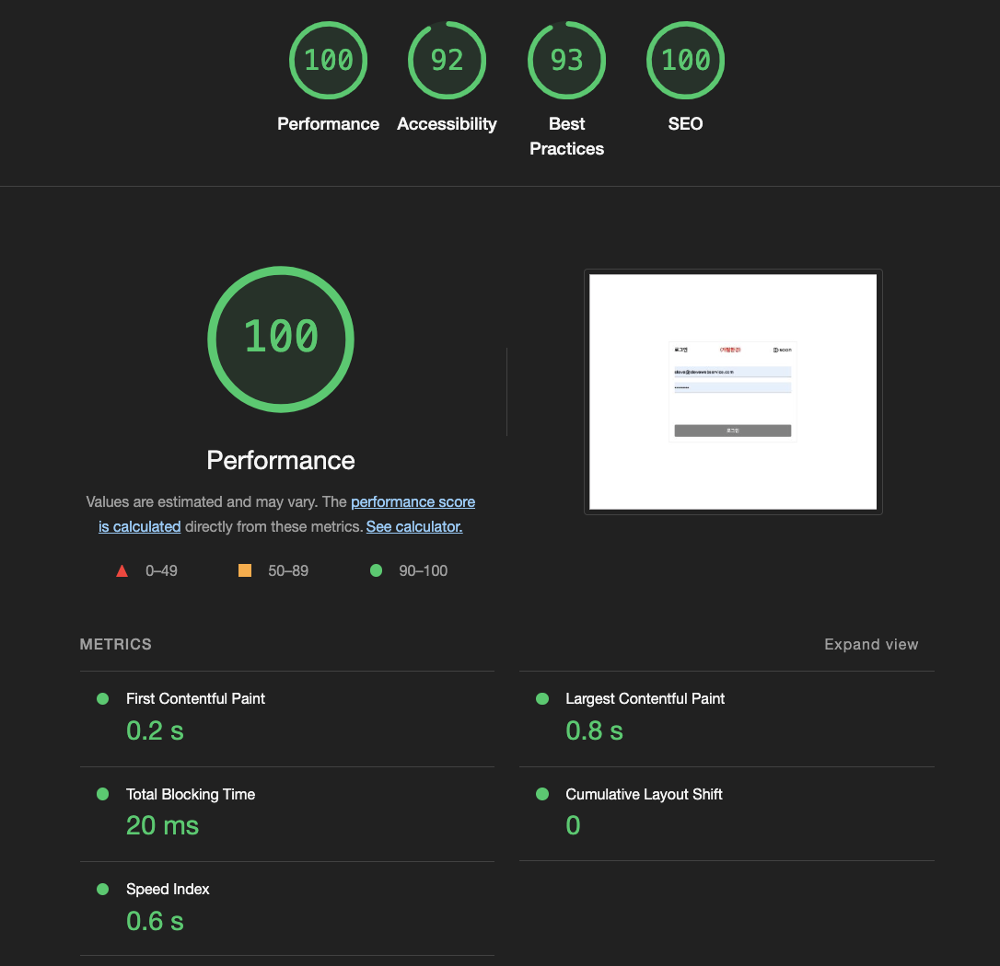
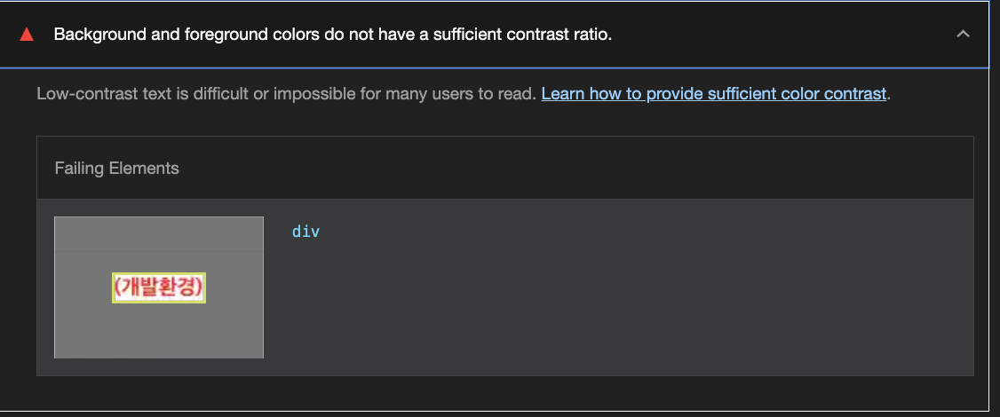
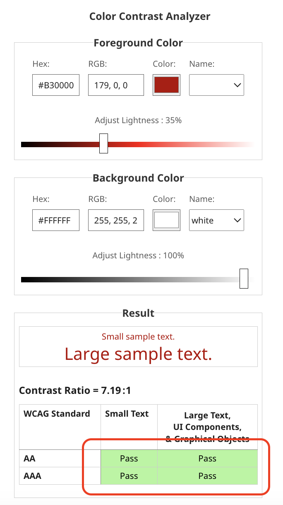
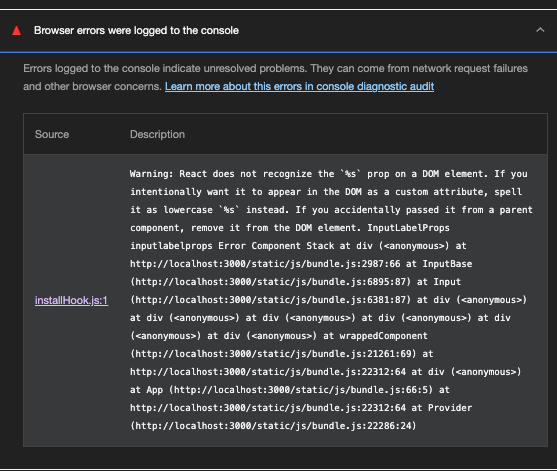

# Lighthouse Performance & Tree Fix Note

- [Lighthouse Performance \& Tree Fix Note](#lighthouse-performance--tree-fix-note)
  - [성능 최적화](#성능-최적화)
    - [미사용 패키지 제거와 UI 라이브러리 트리셰이킹](#미사용-패키지-제거와-ui-라이브러리-트리셰이킹)
      - [결과](#결과)
  - [접근성 수정](#접근성-수정)
    - [Image elements do not have \[alt\] attributes(이미지에 alt 설정하지 않아 생긴 이슈)](#image-elements-do-not-have-alt-attributes이미지에-alt-설정하지-않아-생긴-이슈)
    - [Background and foreground colors do not have a sufficient contrast ratio.(배경색과 폰트색의 색상 대비가 맞지 않을 때 일어나는 접근성 이슈)](#background-and-foreground-colors-do-not-have-a-sufficient-contrast-ratio배경색과-폰트색의-색상-대비가-맞지-않을-때-일어나는-접근성-이슈)
  - [Best Practices 점수 개선](#best-practices-점수-개선)
    - [Browser errors were logged to the console(브라우저에 에러콘솔이 수정이 필요한 경우)](#browser-errors-were-logged-to-the-console브라우저에-에러콘솔이-수정이-필요한-경우)


## 성능 최적화

### 미사용 패키지 제거와 UI 라이브러리 트리셰이킹
- 미사용 패키지 lodash, lottie 등 편의성을 위해 나온 라이브러리들의 용량이 대체로 높기 때문에 해당 내용을 로직으로 풀면되어 패키지 제거
- UI라이브러리 @mui/meterial의 트리 셰이킹 가이드에 따라 해당 모듈만 불러오도록 진행
```js
--------------------------------------
(-) import { Input } from "@mui/material";
--------------------------------------
import Input from "@mui/material/Input"; // <-하나의 모듈만 가져오도록 import
```
  - 또한 TextField와 같이 많은 기능을 가지는 컴포넌트의 경우 용량이 비대해질 수 있는 포인트이므로 필요한 기능만 가진 컴포넌트를 import 해줄것
    - TextField를 불러 옴으로서 Modal, InputBase 등등 다양한 컴포넌트가 불러와져 용량만 270kb가 증가하기 떄문에 작은 기능을 가진 Input으로 대체하여 용량을 줄임
```js
--------------------------------------
(-) import TextField from "@mui/material/TextField"; 
--------------------------------------
import Input from "@mui/material/Input"; // <-하나의 모듈만 가져오도록 import
```

#### 결과

- Performance 100점 달성!

## 접근성 수정

### Image elements do not have [alt] attributes(이미지에 alt 설정하지 않아 생긴 이슈)


- 문제 코드
  - img 태그에 alt 속성이 없어 생기는 문제
```js
<div style={{ display: 'flex', flexDirection: 'row', justifyContent: 'space-between', alignItems: 'center' }}>
    <div style={{ color: 'black', fontWeight: 'bold' }}>로그인</div>
    {isDevEnv && <div style={{ color: 'red', fontWeight: 'bold' }}>(개발환경)</div>}
    
</div>
```

- 해결 코드
  - img 태그에 alt 속성 추가
```js
<div style={{ display: 'flex', flexDirection: 'row', justifyContent: 'space-between', alignItems: 'center' }}>
    <div style={{ color: 'black', fontWeight: 'bold' }}>로그인</div>
    {isDevEnv && <div style={{ color: 'red', fontWeight: 'bold' }}>(개발환경)</div>}
-----------------------------------
(-)  
-----------------------------------
    
</div>
```

### Background and foreground colors do not have a sufficient contrast ratio.(배경색과 폰트색의 색상 대비가 맞지 않을 때 일어나는 접근성 이슈)


- 문제 코드
```js
<div style={{ backgroundColor: '#ffffff'}}>
  <div style={{ color: 'red', fontWeight: 'bold' }}>(개발환경)</div>
</div>
```

- 해결 코드
  - [color-contrast](https://dequeuniversity.com/rules/axe/4.10/color-contrast) 에서 WCAG Standard 배경색에 맞는 폰트색을 조절하면서 전부 패스하는 색으로 대체할 것

```js
<div style={{ backgroundColor: '#ffffff'}}>
  <div style={{ color: '#B30000', fontWeight: 'bold' }}>(개발환경)</div>
</div>
```

## Best Practices 점수 개선

### Browser errors were logged to the console(브라우저에 에러콘솔이 수정이 필요한 경우)
- 표시된 에러콘솔과 관련된 내용을 모두 수정하여 개선한다.
