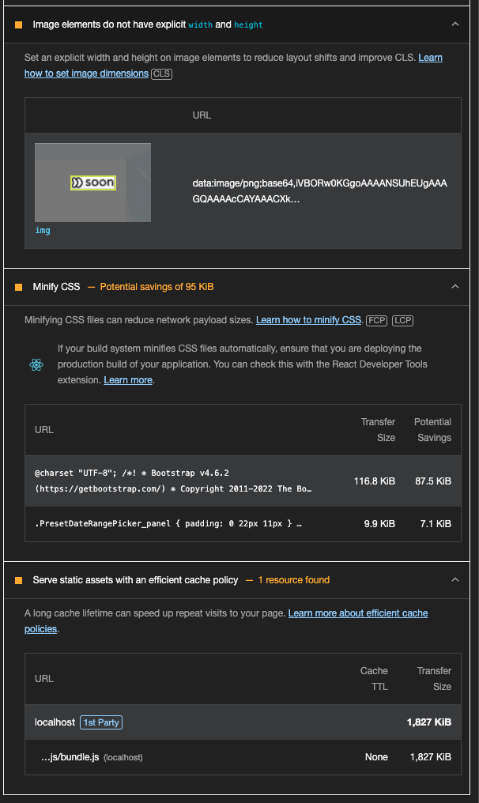

## Before
- Webpack Bundle Analyzer로 확인해본 결과, 모든 라우팅에 대한 컴포넌트들을 불러오고 있어 메인 번들 js 용량이 비대해져있음(용량 9.04MB)


#### Lighthouse 문제 이슈


<!-- 




 -->

**요약**
1. 퍼포먼스 지수 분석
- SI: +8
- FCP: +10
- LCP: +15
- CLS: +25
- TBT: +23

```
1. Speed Index (SI): +8
의미: 화면 콘텐츠가 시각적으로 표시되는 속도를 측정.
개선 분석:
이미지 최적화: WebP 또는 Lazy Loading으로 초기 이미지 로딩이 가속화.
코드 스플리팅: JavaScript 번들을 분리하여 초기 로딩 속도가 개선.
Render Blocking 리소스 제거: CSS/JS 리소스를 최적화하여 브라우저 렌더링 지연을 줄임.
효과:
사용자가 페이지를 더 빠르게 볼 수 있어 UX가 향상.

2. First Contentful Paint (FCP): +10
의미: 첫 번째 콘텐츠가 사용자 화면에 렌더링되는 시간.
개선 분석:
Critical CSS 사용: 첫 번째 렌더링에 필요한 CSS만 로드.
폰트 최적화: 폰트 디스플레이를 swap으로 설정하여 폰트 로딩 지연 제거.
JavaScript 번들 크기 감소: Tree Shaking 및 Minification으로 JS 크기를 줄임.
효과:
초기 렌더링 속도가 개선되어 사용자 만족도가 증가.

3. Largest Contentful Paint (LCP): +15
의미: 가장 큰 콘텐츠(예: 메인 이미지, 히어로 텍스트)가 화면에 렌더링되는 시간.
개선 분석:
Lazy Loading 이미지: 뷰포트에 들어온 이미지만 로드하여 LCP를 개선.
Hero Image 최적화: 중요한 이미지의 크기, 형식(WebP) 최적화.
서버 응답 속도 개선: CDN을 사용해 정적 자산 로딩을 가속화.
효과:
중요한 콘텐츠가 더 빨리 로드되어 사용자 인지 속도 향상.

4. Cumulative Layout Shift (CLS): +25
의미: 페이지 로딩 중 레이아웃 이동 정도를 측정.
개선 분석:
이미지 및 광고 크기 고정: 이미지와 광고 요소의 크기를 명시적으로 설정하여 레이아웃 이동 제거.
폰트 로딩 최적화: FOUT(Flash of Unstyled Text) 또는 FOIT(Flash of Invisible Text)를 방지.
비동기 스크립트 관리: Third-party 스크립트가 레이아웃에 영향을 주지 않도록 설정.
효과:
시각적 안정성이 향상되어 사용자가 콘텐츠를 읽는 데 방해받지 않음.

5. Total Blocking Time (TBT): +23
의미: 메인 스레드가 차단되어 사용자가 상호작용하지 못하는 시간.
개선 분석:
JavaScript 실행 최적화: 중복 및 불필요한 코드를 제거.
Web Worker 도입: CPU 집약적인 작업을 백그라운드에서 처리.
Third-party 스크립트 최적화: 불필요한 타사 스크립트를 제거하거나 비동기로 로드.
Long Task 분리: 긴 작업을 나누어 브라우저의 반응성을 높임.
효과:
사용자 입력(클릭, 스크롤)과 같은 상호작용의 응답성이 향상.

Lighthouse 주요 성능 지표의 방향성
지표	설명	값의 방향	높을수록 좋은가?
SI (Speed Index)	콘텐츠가 시각적으로 로드되는 속도	낮을수록 좋음	✗ (낮을수록 좋음)
FCP (First Contentful Paint)	첫 번째 콘텐츠가 렌더링되는 시간	낮을수록 좋음	✗ (낮을수록 좋음)
LCP (Largest Contentful Paint)	가장 큰 콘텐츠가 화면에 렌더링되는 시간	낮을수록 좋음	✗ (낮을수록 좋음)
CLS (Cumulative Layout Shift)	페이지 로딩 중 레이아웃 이동 정도	낮을수록 좋음 (0에 가까울수록)	✗ (낮을수록 좋음)
TBT (Total Blocking Time)	메인 스레드가 차단된 총 시간	낮을수록 좋음	✗ (낮을수록 좋음)

증가폭에 대한 해석

증가폭의 의미:
Lighthouse 리포트의 "증가폭"은 최적화 전후의 개선 정도를 나타냅니다.
예를 들어, LCP: +15는 최적화 작업으로 인해 LCP(시간)가 15점만큼 개선되었다는 것을 의미합니다.

값이 낮아졌다는 의미:
LCP가 개선되면 중요한 콘텐츠(예: 히어로 이미지, 주요 텍스트)가 더 빠르게 렌더링된다는 의미입니다.
TBT가 낮아지면 메인 스레드 차단 시간이 줄어들어 사용자 입력(클릭, 스크롤) 응답 속도가 빨라진다는 뜻입니다.
CLS와 점수 해석
CLS는 0.1 이하가 이상적이며, 0에 가까울수록 레이아웃 이동이 거의 없음을 의미합니다.
높은 증가폭은 CLS 값이 개선되어 사용자 경험이 안정적이라는 뜻입니다.
결론
증가폭은 높을수록 개선 효과가 크다는 것을 의미하지만, 지표 값 자체는 낮을수록 좋은 성능을 의미합니다.
최적화 작업을 통해 지표 값을 낮추는 것이 목표입니다. 😊
좋은 기준값
LCP: 2.5초 이하.
FCP: 1.8초 이하.
CLS: 0.1 이하.
TBT: 200ms 이하.
SI: 4.3초 이하.
```

#### 원본 코드

<details>
<summary>접기/펼치기</summary>
<div markdown="1">

```js
import React, { Component, useEffect } from "react";
import { observable } from "mobx";
import { observer, inject } from "mobx-react";
import { BrowserRouter as Router, Route, Redirect, useHistory } from "react-router-dom";
import Lottie from "react-lottie";
import * as animationData from "./assets/lottie_files/login.json";
import axios from 'axios'
import "react-dates/initialize";
import "react-dates/lib/css/_datepicker.css";
import "./app.css";

import PleaseTellWhoYouAre from "./Screens/PleaseTellWhoYouAre";

import ManageNotice from "./Screens/ManageNotice";
import DashBoard from "./Screens/DashBoard";
import ReviewInfo from "./Components/ReviewInfo";
import UserInfo from "./Components/UserInfo";
import LoadingSpinner from "./Components/LoadingSpinner";
import { CircularProgress } from "@material-ui/core";

import { get, map, compact, result } from "lodash";
import Modal from "react-modal";
import SoonMonsterMaps from "./Screens/Map";
import MonsterDrawer from "./Components/MonsterDrawer";
import Reservation from "./Screens/Reservation";
import EmployerList from "./Screens/employer/EmployerList";
import SeekerList from "./Screens/seeker/SeekerList";
import Transaction from "./Screens/Transaction";
import UserVerificationRequestList from "./Screens/UserVerificationRequestList";
import DataCenter from "./Screens/DataCenter";
import BlackList from "./Screens/BlackList";
import Enterprise from './Screens/Enterprise'

import UserAccessControlPage from "./Screens/UserAccessControlPage";
import { refreshTokenUser, sessionActivityLog, signInUser } from "./api/users";
import { getAdminUsers } from "./api/userAccessControl";
import SignUp from "./Screens/createUser";
import UserActivityLogPage from "./Screens/UserActivityLogPage";
import UserAccountLogPage from "./Screens/UserAccountLogPage";
import UserloginattemptLogPage from "./Screens/UserloginattemptLogPage";
import UserloginattemptAppLogPage from "./Screens/UserloginattemptAppLogPage";
import LongtermReservation from "./Screens/LongtermReservation";
import { usePRD } from "./api/requestApi";
import ReservationOld from "./Screens/ReservationOld";
import { getTokenFromCookie } from "./utils/soonUtill";
import MonsterMainStore from './store/MonsterMainStore';
import SearchWithdraw from "./Screens/SearchWithdraw";

class App extends Component {
  @observable whoAmI = "";
  @observable whoAmITextInput = "";
  @observable currentPage = "home";
  @observable loadingToken = true;

  constructor(props) {
    super(props);
  }

  async checkAccessToken() {
    const refreshToken = getTokenFromCookie('@refreshToken');

    if (!refreshToken) {

      this.whoAmI = "";
      this.props.MonsterMainStore.setCurrentUser(null, null);
      this.loadingToken = false;
      // alert('토큰이 만료되었습니다. 로그인 재시도 해주세요')

    } else {
      await refreshTokenUser();
      const refreshToken2 = getTokenFromCookie('@refreshToken');

      if (!refreshToken2) {

        this.whoAmI = "";
        this.props.MonsterMainStore.setCurrentUser(null, null);
        this.loadingToken = false;
        alert('토큰이 만료되었습니다. 로그인 재시도 해주세요')
        return
      }
      const id = localStorage.getItem("@id");
      // const menuResult = await getPermissionMenu({
      //   adminId: id.toLowerCase(),
      // });
      // if (menuResult?.status === "OK") {
      //   const menuData = menuResult.data;
      //   this.props.MonsterMainStore.setUserInfo(menuData);
      // }
      const accessToken = getTokenFromCookie('@accessToken');
      this.whoAmI = id;
      this.props.MonsterMainStore.setCurrentUser(id, accessToken);
    }
  }

  componentDidMount() {

    // const isVpn = window.location.host.includes('admin-vpn')
    // const isDev = (window.location.host.includes('dev-admin') || window.location.host.includes('localhost') && usePRD === false)

    // let data = JSON.stringify({
    //   "countInitialization": true
    // });

    // let config = {
    //   method: 'get',
    //   maxBodyLength: Infinity,
    //   url: (isVpn ? 'https://r8j4azwvnd-vpce-03e7fac345fac9bae.execute-api.ap-northeast-2.amazonaws.com/vpn/api/admin/public/health' : (isDev ? 'https://dev-api.sooooon.com/api/public/health' : 'https://api.sooooon.com/api/public/health')),
    //   headers: {
    //     'Content-Type': 'application/json'
    //   },
    //   data: data
    // };

    // axios.request(config)
    //   .then((response) => {
    //   })
    //   .catch((error) => {
    //   });

    this.checkAccessToken();
    // var myHeaders = new Headers();
    // myHeaders.append("Content-Type", "application/json");

  }


  getMonsterUserPhonenumbers = async () => {

    return [];
  };


  //actionType: signup, login
  requestAuthCode = async (phoneNumber, actionType) => {
    try {
      const phoneNumbers = await this.getMonsterUserPhonenumbers();

      if (!phoneNumbers.includes(phoneNumber)) {
        alert("phone number is not allowed");
        return;
      }

      const res = await this.sendSmsToVerifyForSignup({ phoneNumber, actionType });
      const resData = res.data;
      const result = resData.data;


      if (resData.status == "SUCCESS") {
        this.verificationsId = result.verificationsId;
        return {
          status: "SUCCESS",
          data: result,
        };
      } else {
        return { status: "FAIL", reason: result.reason };
      }
    } catch (error) {

      return { status: "FAIL" };
    }
  };

  verifyAuthCode = async (authCode, phoneNumber) => {
    try {
      const res = await this.verifyAuthCodeForSignup({
        authCode,
        phoneNumber,
        verificationId: this.verificationsId,
      });
      const resData = res.data;
      const result = resData.data;

      if (resData.status === "SUCCESS") {
        return {
          status: "SUCCESS",
          data: result,
        };
      } else {
        return { status: "FAIL", reason: resData.error };
      }
    } catch (error) {
      return { status: "FAIL" };
    }
  };

  changePage = (page = "") => (this.currentPage = page);

  render() {
    if (this.whoAmI === "") {
      return (
        <div
          style={{
            width: "100vw",
            height: "100vh",
          }}
        >
          <Lottie
            options={{
              animationData: animationData,
              rendererSettings: {
                preserveAspectRatio: "xMidYMid meet",
              },
            }}
          />
          {this.loadingToken ? (
            <div
              style={{
                position: "absolute",
                right: 0,
                left: 0,
                top: 0,
                bottom: 0,
                display: "flex",
                justifyContent: "center",
                alignItems: "center",
              }}
            >
              <CircularProgress />
            </div>
          ) : (
            <PleaseTellWhoYouAre
              window={window}
              requestAuthCode={this.requestAuthCode}
              verifyAuthCode={this.verifyAuthCode}
              loginCallback={(displayName) => (this.whoAmI = displayName)}
            />
          )}
        </div>
      );
    }
    return (
      <Router>
        <div
          style={{
            display: "flex",
            flex: 1,
            flexDirection: "row",
          }}
        >
          <RouteControl {...this.props} changePage={this.changePage} />
          <MonsterDrawer
            window={window}
            changePage={this.changePage}
            currentPage={this.currentPage}
            clear={() => {
              this.whoAmI = "";
              this.props.MonsterMainStore.setCurrentUser(null, null);
              this.loadingToken = false;
            }}
          />
          <div
            id="content-area"
            style={{
              padding: 18,
              paddingBottom: 0,
              display: "flex",
              flex: 1,
              flexDirection: "column",
            }}
          >
            <Route exact path="/" component={RedirectPage} />
            <Route path="/reservation" component={Reservation} />
            <Route path="/reservation_old" component={ReservationOld} />
            <Route path="/longterm" component={LongtermReservation} />
            <Route path="/enterprise" component={Enterprise} />

            {/* <Route path="/dashboard" render={() => <WelcomeMonster whoAmI={this.whoAmI} />} /> */}
            {/* <Route path="/dashboard" component={DashBoard} /> */}
            <Route path="/signUp" render={() => <SignUp />} />
            <Route path="/managenotice" component={ManageNotice} />
            {/* <Route path="/reviews" render={() => <ReviewInfo />} /> */}
            {/* <Route path="/userinfo" render={() => <UserInfo />} /> */}
            {/* <PrivateRoute path="/map" isLogin={!!this.whoAmI}>
              <SoonMonsterMaps />
            </PrivateRoute> */}
            {/* <Route path="/data" render={() => <DataCenter />} /> */}
            {/* <Route path="/auth_log" render={() => <UserloginattemptLogPage />} />
            <Route path="/auth_log_app" render={() => <UserloginattemptAppLogPage />} />
            <Route path="/activity_log" render={() => <UserActivityLogPage />} />
            <Route path="/account_log" render={() => <UserAccountLogPage />} /> */}
            <Route path="/userAccessControlPage" render={() => <UserAccessControlPage />} />
            <Route path="/searchWithdraw" render={() => <SearchWithdraw />} />
            {/* <Route path="/blacklist" render={() => <BlackList />} /> */}
            <Route path="/employers" render={() => <EmployerList />} />
            <Route path="/alba" render={() => <SeekerList />} />
            <Route path="/transactions" render={() => <Transaction />} />
            {/* <Route path="/user_verification_request" render={() => <UserVerificationRequestList />} /> */}
          </div>
          <LoadingSpinner />
        </div>
      </Router>
    );
  }
}

const PrivateRoute = ({ children, isLogin, ...rest }) => (
  <Route
    {...rest}
    render={({ location }) =>
      isLogin ? (
        children
      ) : (
        <Redirect
          to={{
            pathname: "/",
            state: { from: location },
          }}
        />
      )
    }
  />
);

/**
 * 라우트 전환 컨트롤
 */
const RouteControl = (props) => {
  const history = useHistory();
  const changePage = props.changePage

  // const checkPermissionList = (list = [], currentPage) => {
  //   const isInPermissionPage = list.includes(currentPage);

  //   if (!isInPermissionPage && currentPage && currentPage !== "reservation" && currentPage !== "reservation_old" && currentPage !== "signup") {
  //     alert("접근권한이 없습니다.");
  //     history.push("/reservation");
  //   }
  // };

  const currentPage = location.pathname.slice(1, location.pathname.length);
  const accessibleMenuList = props.MonsterMainStore.userInfo.accessibleMenuList;
  useEffect(() => {
    // checkPermissionList(accessibleMenuList, currentPage);
    // location :  내가 어디 있는지
    history.listen((location, action) => {
      const currentPage = location.pathname.slice(1, location.pathname.length);
      changePage(currentPage)
      // checkPermissionList(accessibleMenuList, currentPage);
    });
  }, [props.MonsterMainStore.userInfo, accessibleMenuList]);

  return <div></div>;
};

const WelcomeMonster = ({ whoAmI }) => (
  <div
    id="home-page"
    style={{
      flexDirection: "column",
      alignItems: "center",
      justifyContent: "center",
    }}
  >
    <h1>{`반가워요 ${whoAmI}`}</h1>
    <div
      onClick={() => {
        localStorage.clear();
        window.location.reload();
      }}
    >
      만약 {whoAmI}가 아니라면 이곳을 눌러주세요.
    </div>
  </div>
);
const RedirectPage = (props) => {
  return <Redirect to="/reservation" />;
};

export default inject("MonsterMainStore")(observer(App));

```

</div>
</details>


## After
- App 컴포넌트의 라우팅과 사이드 네비, 첫화면 렌더링에 사용되는 PleaseTellWhoYouAre 컴포넌트의 코드 스플리팅(lazy loading) 처리, 미사용 컴포넌트 제거 등으로 메인 번들사이즈 절반이상 줄어듦(4.78 MB)


  
#### Lighthouse 지표 개선사항


- lazy loading으로 눈에 띄게 퍼포먼스가 개선이되었음
  - 퍼포먼스 점수: 80 -> 93점 (+ 13점)
  - FCP(First Contentful Paint, 첫번째 콘텐츠 렌더링되는 시간): 0.2s -> 0.2s (동일)
  - LCP(Largest Contentful Paint: 가장 큰 콘텐츠 렌더링 시간): 2.1s -> 1.4s (0.7초 감소)
  - TBT(Total Blocking Time: JS 실행으로 인해 입력이 차단된 시간): 220ms -> 140ms (80ms 감소)
  - SI(Speed Index: 페이지가 시각적으로 로드되는 속도): 1.7s -> 1.1s (0.6초 감소)
- **주의할점**: 코드스플리팅의 대상은 당장 렌더링 될 필요없는 대상들에 한해서 진행되어야함, 
  아래 코드에서 PleaseTellWhoYouAre 컴포넌트와 같이 필수로 렌더링되는 컴포넌트 까지 lazy Loading을 하게되면 초기 렌더링 시점에 바로 로드가 진행되기 때문에 메인 스레드에서 로드되는 동안 차단될 것이고 TBT(메인 스레드의 차단 시간)의 증가를 초래할 수 있다는 점을 명심해야함


#### 변경된 코드

<details>
<summary>접기/펼치기</summary>
<div markdown="1">

```js
import React, { Component, Suspense } from "react";
import { observable } from "mobx";
import { observer, inject } from "mobx-react";
import { BrowserRouter as Router, Route, Redirect } from "react-router-dom";
import Lottie from "react-lottie";
import * as animationData from "./assets/lottie_files/login.json";
import { CircularProgress } from "@material-ui/core";
import { getTokenFromCookie } from "./utils/soonUtill";
import LoadingSpinner from "./Components/LoadingSpinner";
import PleaseTellWhoYouAre from './Screens/PleaseTellWhoYouAre'

// Lazy-loaded components
const MonsterDrawer = React.lazy(() => import("./Components/MonsterDrawer"));
const Reservation = React.lazy(() => import("./Screens/Reservation"));
const ReservationOld = React.lazy(() => import("./Screens/ReservationOld"));
const LongtermReservation = React.lazy(() => import("./Screens/LongtermReservation"));
const Enterprise = React.lazy(() => import("./Screens/Enterprise"));
const ManageNotice = React.lazy(() => import("./Screens/ManageNotice"));
const UserAccessControlPage = React.lazy(() => import("./Screens/UserAccessControlPage"));
const SearchWithdraw = React.lazy(() => import("./Screens/SearchWithdraw"));
const EmployerList = React.lazy(() => import("./Screens/employer/EmployerList"));
const SeekerList = React.lazy(() => import("./Screens/seeker/SeekerList"));
const Transaction = React.lazy(() => import("./Screens/Transaction"));

class App extends Component {
  @observable whoAmI = "";
  @observable loadingToken = true;

  async checkAccessToken() {
    const refreshToken = getTokenFromCookie("@refreshToken");
    if (!refreshToken) {
      this.whoAmI = "";
      this.props.MonsterMainStore.setCurrentUser(null, null);
      this.loadingToken = false;
    } else {
      const id = localStorage.getItem("@id");
      const accessToken = getTokenFromCookie("@accessToken");
      this.whoAmI = id;
      this.props.MonsterMainStore.setCurrentUser(id, accessToken);
    }
  }

  componentDidMount() {
    this.checkAccessToken();
  }

  render() {
    if (this.whoAmI === "") {
      return (
        <div style={{ width: "100vw", height: "100vh" }}>
          <Lottie
            options={{
              animationData: animationData,
              rendererSettings: {
                preserveAspectRatio: "xMidYMid meet",
              },
            }}
          />
          {this.loadingToken ? (
            <div
              style={{
                position: "absolute",
                right: 0,
                left: 0,
                top: 0,
                bottom: 0,
                display: "flex",
                justifyContent: "center",
                alignItems: "center",
              }}
            >
              <CircularProgress />
            </div>
          ) : (
            <PleaseTellWhoYouAre
              window={window}
              loginCallback={(displayName) => (this.whoAmI = displayName)}
            />
          )}
        </div>
      );
    }

    return (
      <Router>
        <div style={{ display: "flex", flex: 1, flexDirection: "row" }}>
          <MonsterDrawer
            window={window}
            currentPage={this.props.currentPage}
            clear={() => {
              this.whoAmI = "";
              this.props.MonsterMainStore.setCurrentUser(null, null);
              this.loadingToken = false;
            }}
          />
          <div
            id="content-area"
            style={{
              padding: 18,
              paddingBottom: 0,
              display: "flex",
              flex: 1,
              flexDirection: "column",
            }}
          >
            <Suspense fallback={<div>Loading...</div>}>
              <Route exact path="/" component={() => <Redirect to="/reservation" />} />
              <Route path="/reservation" component={Reservation} />
              <Route path="/reservation_old" component={ReservationOld} />
              <Route path="/longterm" component={LongtermReservation} />
              <Route path="/enterprise" component={Enterprise} />
              <Route path="/managenotice" component={ManageNotice} />
              <Route path="/userAccessControlPage" component={UserAccessControlPage} />
              <Route path="/searchWithdraw" component={SearchWithdraw} />
              <Route path="/employers" component={EmployerList} />
              <Route path="/alba" component={SeekerList} />
              <Route path="/transactions" component={Transaction} />
            </Suspense>
          </div>
          <LoadingSpinner />
        </div>
      </Router>
    );
  }
}

export default inject("MonsterMainStore")(observer(App));

```

</div>
</details>

